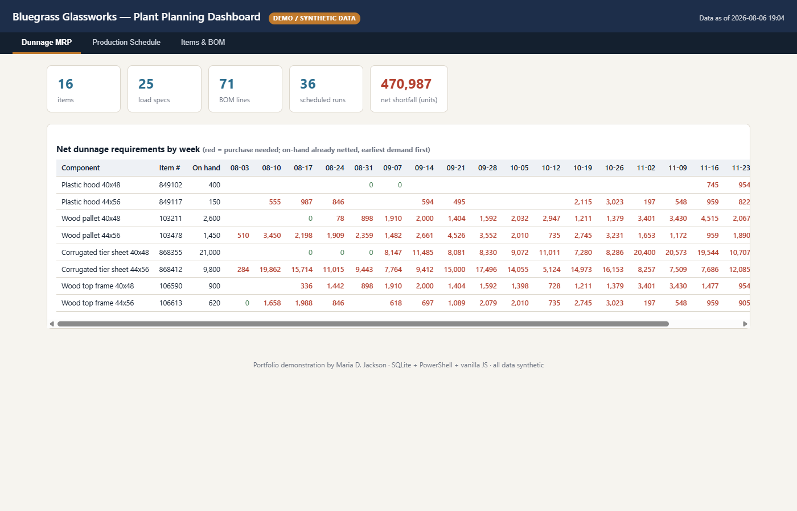
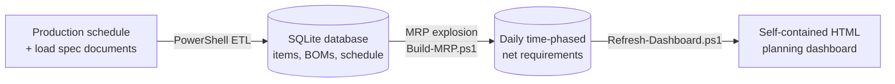

# Glass Plant MRP — SQL Database, Time-Phased MRP & Planning Dashboard

**A working demonstration of a production planning system I designed and built as a
Materials Resource Planner at a glass container manufacturing plant.**

> ⚠️ Everything in this repository is **synthetic demo data** for a fictional company
> ("Bluegrass Glassworks"). The architecture, data model, and MRP logic mirror the real
> system I built and run daily at work — the numbers do not.

**▶ [View the live dashboard](https://mdjackson1883.github.io/glass-plant-mrp/)** — no install needed.



## The business problem

A glass plant runs its forming machines around the clock. Every pallet of finished
bottles consumes **dunnage** — pallets, corrugated tier sheets, wood top frames,
plastic hoods. Before this system existed, dunnage purchasing was reactive: nobody
could answer *"how many 44x56 tier sheets do we need in week 38, given the current
production schedule?"* without hours of manual spreadsheet work — and stockouts stop
production lines.

## The solution

A three-layer pipeline, rebuilt on demand from source data:



1. **Relational database (SQLite / PostgreSQL-compatible DDL).** The key modeling
   decision: the dunnage bill of materials is keyed by **load spec × component**, not
   item × component — because the same bottle palletized two different ways consumes
   different packaging. See [sql/schema.sql](sql/schema.sql).

2. **Time-phased MRP engine (PowerShell).** Explodes the machine schedule against the
   BOM: bottles/minute × 1440 × pack efficiency ÷ bottles-per-pallet = pallets/day,
   then components/day. Nets gross requirements against on-hand inventory,
   consuming earliest demand first, forward-only from the as-of date. See
   [scripts/Build-MRP.ps1](scripts/Build-MRP.ps1).

3. **Zero-dependency dashboard.** A single offline HTML file (vanilla JS, data
   embedded as JSON at build time) with a weekly net-requirements pivot, the machine
   campaign schedule, and per-item BOM drill-downs. No server, no install — it opens
   on any plant PC. [See it live](https://mdjackson1883.github.io/glass-plant-mrp/)
   or open [dashboard/Dashboard.html](dashboard/Dashboard.html) locally.

## What the real system does in production

The production version of this architecture (built May–June 2026, in daily use):

- 15+ table relational database covering 80+ bottle specs, 138 load specs,
  440+ carton variants, and a 4-machine schedule of 130+ campaign runs
- Per-day dunnage MRP with on-hand netting and purchasing item numbers,
  refreshed by a one-click pipeline whenever the schedule changes
- Interactive dashboard with MRP drill-down to the run level, load-spec
  overrides, and an on-hand entry screen used for daily planning

## Run it yourself

Requires Windows PowerShell 5.1+ and `sqlite3.exe`
(`winget install SQLite.SQLite`).

```powershell
.\scripts\Generate-SeedData.ps1        # regenerate synthetic data (deterministic, seed=42)
.\scripts\Build-Database.ps1           # rebuild bluegrass.db from schema + seed SQL
.\scripts\Build-MRP.ps1                # explode schedule -> daily net requirements
.\scripts\Refresh-Dashboard.ps1        # render dashboard\Dashboard.html
.\scripts\Export-PowerBIData.ps1       # dump every table to powerbi\data\*.csv
```

Each script is idempotent — the database is always a pure function of the committed
SQL, so there is no drift between source and output.

## Skills demonstrated

| Area | Where |
|---|---|
| Relational data modeling (3NF, FKs, views, grain decisions) | [sql/schema.sql](sql/schema.sql) |
| SQL (joins, aggregates, derived tables) | [scripts/Refresh-Dashboard.ps1](scripts/Refresh-Dashboard.ps1) queries |
| MRP / supply chain logic (BOM explosion, netting, time-phasing) | [scripts/Build-MRP.ps1](scripts/Build-MRP.ps1) |
| PowerShell automation & ETL | all of [scripts/](scripts) |
| Data visualization without dependencies | [dashboard/template.html](dashboard/template.html) |

## About me

**Maria D. Jackson** — Materials Resource Planner / MRP & Data Analyst.
25 years in production planning, scheduling, and inventory control (SAP, PLEX, AS400),
now pairing that domain expertise with SQL, PowerShell, and Excel/VBA automation.

📍 Cincinnati, OH · [linkedin.com/in/maria-d-jackson](https://www.linkedin.com/in/maria-d-jackson)
